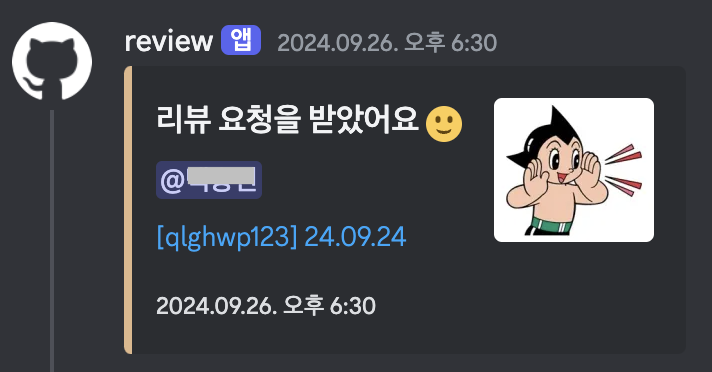

# PR Review Notification

PR 리뷰 요청을 받으면 Discord로 알리는 Github Actions



- image_url
  메세지에 들어갈 이미지입니다.

- webhook_url
  리뷰요청을 받은 뒤, 메세지를 전송할 웹훅 주소입니다.

- user_table
  리뷰요청을 받은 뒤,
  메세지에서 언급할 DISCORD ID와 github의 user name을 담은 json 객체입니다.

```yml
name: Notification PR Review

on:
  pull_request:
    types: [review_requested]

jobs:
  runs-on: ubuntu-latest
  steps:
    - name: Notification PR Review
      uses: oris-8/notification-pr-review@v1.0.1
      with:
        image_url: "https://github.com/user-attachments/assets/26a"
        webhook_url: ${{ secrets.WEBHOOK_URL }}
        user_table: "{ 'oris8': "1251231' }"
```
